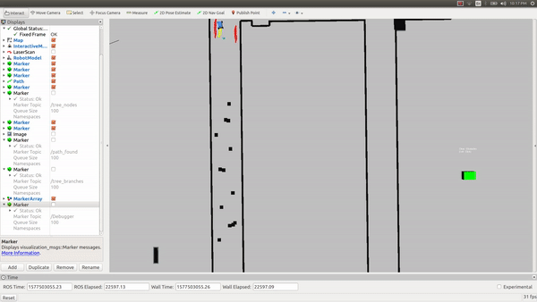

# Hierarchical-MPC
Hierarchical Model Predictive Control for the F1/10 autonmous car

High-level Trajectory Planner: At every time instance, select from a trajectory that maximizes progress along track centerline from a precomputed table of feasible trajectories.

Low-level MPC tracking controller: The MPC generates a dynamically feasible trajectory that tracks the reference trajectory given by the high level planner while satisfying all constraints.

For obstacle avoidance, RRT* is incorparated to provide convex feasible space constraints in real time to MPC based on LiDAR feedbacks.

Testing on the car: 

Head-to-head Racing:

